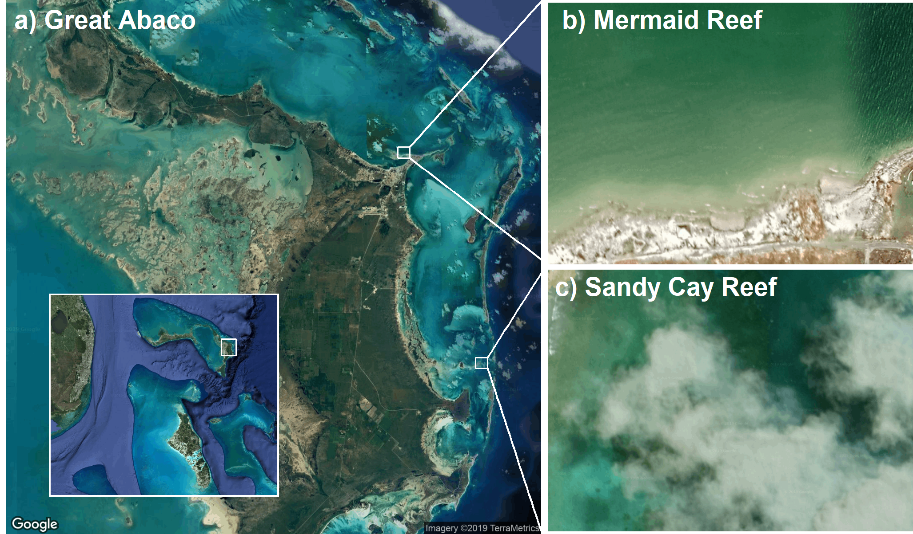

```{r setup, include=FALSE}
knitr::opts_chunk$set(echo = TRUE)

library(tidyverse)
library(janitor)
library(lubridate)
library(cowplot)
library(grid)
library(ggmap)  # devtools::install_github("dkahle/ggmap")
```

# Map of Mermaid Reef and Sandy Cay Reef
```{r, eval = FALSE}
# Map figure (Figures/map.png) generated in October 2019 -- current Google Imagery may be different
register_google(key = readLines("google_api_key"))

mermaid <- c(lon = -77.05280, lat = 26.55358)
sandy <- c(lon = -76.98903, lat = 26.39886)
mid <- c(lon = -77.16, lat = 26.47)
bah <- c(lon = -78, lat = 25.5)
loc <- bind_rows(mermaid = mermaid, sandy = sandy, .id = "reef")

map_bahamas <- get_map(location = bah, source = "google", maptype = "satellite", zoom = 7)
map_abaco <- get_map(location = mid, source = "google", maptype = "satellite", zoom = 11)
map_mermaid <- get_map(location = mermaid, source = "google", maptype = "satellite", zoom = 18)
map_sandy <- get_map(location = sandy, source = "google", maptype = "satellite", zoom = 18)

gm_bah <- ggmap(map_bahamas, extent = "device") +
  geom_rect(aes(xmin = -77.25, xmax = -76.93, ymin = 26.3, ymax = 26.62), fill = NA, color = "white", lwd = 0.4) +
  scale_x_continuous(limits = c(-81, -76), expand = c(0, 0)) +
  scale_y_continuous(limits = c(23.5, 27.5), expand = c(0, 0)) +
  geom_rect(aes(xmin  = -80.99, xmax = -76, ymin = 23.51, ymax = 27.5), fill = NA, color = "white", lwd = 0.75) +
  theme(axis.line = element_blank())

gm_abaco <- ggmap(map_abaco, extent = "device") +
  #scale_y_continuous(limits = c(-77.39, -76.9), expand = c(0, 0)) +
  #geom_point(data = loc, aes(x = lon, y = lat), color = "white", pch = 22, cex = 4, lwd = 10) +
  annotate("rect", xmin = -77.058, xmax = -77.048, ymin = 26.550, ymax = 26.558, 
           col = "white", fill = NA, lwd = 0.4) +
  annotate("rect", xmin = -76.994, xmax = -76.984, ymin = 26.395, ymax = 26.403, 
           col = "white", fill = NA, lwd = 0.4) +
  annotate("segment", x = -77.048, xend = -76.94, y = 26.558, yend = 26.665, colour = "white") +
  annotate("segment", x = -77.048, xend = -76.94, y = 26.550, yend = 26.475, colour = "white") +
  annotate("segment", x = -76.984, xend = -76.94, y = 26.403, yend = 26.465, colour = "white") +
  annotate("segment", x = -76.984, xend = -76.94, y = 26.395, yend = 26.275, colour = "white") +    
  ggmap::inset(ggplotGrob(gm_bah), xmin = -77.4, xmax = -77.1, ymin = 26.3, ymax = 26.45) +
  theme(axis.line = element_blank())

gm_mermaid <- ggmap(map_mermaid, extent = "device") +
  scale_y_continuous(limits = c(26.5525, 26.5545)) +
  theme(axis.line = element_blank())

gm_sandy <- ggmap(map_sandy, extent = "device") +
  scale_y_continuous(limits = c(26.3980, 26.4000)) +
  theme(axis.line = element_blank())

zooms <- plot_grid(gm_mermaid, gm_sandy, ncol = 1, 
                   labels = c("  b) Mermaid Reef", " c) Sandy Cay Reef"),
                   label_colour = "white", hjust = 0)

mapfig <- plot_grid(gm_abaco, zooms, ncol = 2, rel_widths = c(0.6, 0.4),
                    labels = c("  a) Great Abaco", NA), label_colour = "white", hjust = 0)

ggsave(filename = "Figures/Fig1.png", plot = mapfig,
       width = 174, height = 102, units = "mm")
```



# Temperature Data # 

# Import Temperature Data

# Mermaid Reef
```{r}
# May - October 2015
mermaid1 <- read_csv("Data/Temperature/Mermaid's_Reef_download1.csv", skip = 2) %>%
  clean_names() %>%
  mutate(time = mdy_hms(date_time_gmt_04_00),
         site = "mermaid_reef") %>%
  select(time, site, temp_c)
range(mermaid1$time)
```

```{r}
# August 2018 - January 2019
mermaid2 <- read_csv("Data/Temperature/Mermaid_Reef_8-2018_0.csv", skip = 2) %>%
  clean_names() %>%
  mutate(time = mdy_hms(date_time_gmt_04_00),
         site = "mermaid_reef") %>%
  select(time, site, temp_c) %>%
  slice(1:(n()-20))    # get rid of some wonky data at the end
range(mermaid2$time)
```

# Sandy Cay Reef
```{r}
# May 2015 - October 2015
sandy0 <- read_csv("Data/Temperature/Sandy_Cay_Reef_-_Backreef#8_0.csv", skip = 2) %>%
  clean_names() %>%
  mutate(time = mdy_hms(date_time_gmt_04_00),
         site = "sandy_cay_reef",
         temp_c = (temp_f - 32) * 5/9) %>%
  select(time, site, temp_c) %>%
  slice(100:n())   # get rid of some wonky data at the beginning
range(sandy0$time)
```

```{r}
# October 2015 - August 2016
sandy1 <- read_csv("Data/Temperature/SANDY_Cay_Nursery.csv", skip = 2) %>%
  clean_names() %>%
  mutate(time = mdy_hms(date_time_gmt_04_00),
         site = "sandy_cay_nursery") %>%
  select(time, site, temp_c) %>%
  slice(100:n())   # get rid of some wonky data at the beginning
range(sandy1$time)
```

```{r}
# November 2017 - July 2018
sandy2 <- read_csv("Data/Temperature/Sandy_Cay_Reef_2.csv", skip = 2) %>%
  clean_names() %>%
  mutate(time = mdy_hms(date_time_gmt_05_00),
         site = "sandy_cay_reef") %>%
  select(time, site, temp_c) %>%
  slice(1:(n()-120))    # get rid of some wonky data at the end
range(sandy2$time)
```

# Merge datasets
```{r}
df <- bind_rows(mermaid1, mermaid2, sandy0, sandy1, sandy2) %>%
  mutate(monthday = format(time, format = "%m-%d"))
```


# Overlapping Raw Temperature Data from Mermaid Reef and Sandy Cay Reef
```{r}
# Temperature data from overlapping time period
temp_overlap <- df %>%
  filter(time < "2015-10-15") %>%
  filter(site != "sandy_cay_nursery")

temp_time_overlap <- ggplot(temp_overlap, aes(x = time, y = temp_c, color = site)) +
  geom_line(alpha = 0.7, size = 1.2) +
  theme_bw() + 
  theme(panel.grid = element_line(color = "white"),
        axis.title.x = element_text(color = "transparent"),
        axis.text.x = element_text(color = "black"),
        axis.text.y = element_text(color = "black"),
        legend.position = "none") +
  xlab(label = "Month") +
  ylab(expression("Temperature " ( degree*C))) +
  scale_color_manual(name = "Site", labels = c("Mermaid Reef", "Sandy Cay"), values = c("#F8766D","#00BFC4"))

```


# Mermaid Reef vs Sandy Cay Reef t test for temperature data 
```{r}
t.test(temp_c ~ site, data = temp_overlap, paired = FALSE)
```


#Distribution of Recorded Temperature from Mermaid Reef and Sandy Cay Reef
```{r}
# List Temperature Recordings only during overlapping time period
temp_dat <- df %>%
  filter(time < "2015-10-15") %>%
  filter(site != "sandy_cay_nursery") %>%
  select(site, temp_c) %>%
  mutate(site = factor(site, levels = c("sandy_cay_reef", "mermaid_reef")))

density_plot <- ggplot(temp_dat, aes(x = temp_c, fill = site)) +
  geom_density(alpha = 0.6, position = "identity") +
  theme_bw() +
  coord_flip() +
  theme(panel.grid = (element_line(color = "transparent")),
    axis.text.y = element_text(color = "black"),
        axis.text.x = element_text(color = "black"),
        axis.title.y = element_text(color = "transparent"),
    legend.position = "none") +
  xlab(expression("Temperature " (degree*C))) +
  ylab(label = "Frequency") +
  guides(colour = guide_legend(nrow = 1)) +
  scale_y_continuous(expand = c(0,0))  +
  scale_fill_manual(name="",
                         breaks=c("mermaid_reef", "sandy_cay_reef"),
                         labels=c("Mermaid Reef", "Sandy Cay Reef"), values=c( "#00BFC4", "#F8766D"))
```


# Arranging Raaw Temperature Data and Distribution Figures together
```{r}
library(ggpubr) #instal.packages("ggpubr")

# Combined temperature and density figure 
ggarrange(temp_time_overlap, density_plot,
                    labels = c("    a", "   b"), font.label = list(size = 21)) +
  theme(plot.margin=unit(c(1,1,3,0.5),"cm"), legend.position = "bottom")

ggsave(filename = "figures/temp_dens.png", width = 350, height = 175, units = "mm")

```

#Table of Metric Values for Temperature Data
```{r}
# Mean of all Temp Data
library(gridExtra)
library(grid)

mean(df$temp_c, na.rm = TRUE)

metrics<- df %>%
  filter(time < "2015-10-15") %>%
  filter(site != "sandy_cay_nursery") %>%
  group_by(site) %>%
  summarize(
    mean = mean(temp_c, na.rm = TRUE),
    min = min(temp_c, na.rm = TRUE),
    max = max(temp_c, na.rm = TRUE),
    median = median(temp_c, na.rm = TRUE))
```


# AGRRA Data #


# Import Environmental AGRRA Data
```{r}
#Benthic Organism Cover Data
NB_benthic_point_cover <- read_csv("Data/Environmental_Data/benthic_point_cover.csv") %>%
  clean_names() 

benthic_cover <- NB_benthic_point_cover %>%
  select(batch, code, site, date, latitude, longitude, zone, subregion, shelf, ecoregion, depth, nt, 
         live.coral = l_cavg, lc.std = l_cstd, newly.dead.coral = nd_cavg, ndc.std = nd_cstd, 
         algae.crustose = cc_aavg, ac.std = cc_astd, newly.dead.algae.crustose = ndcc_aavg, ndacc.std = ndcc_astd, 
         other.calcifiers = o_cavg, oc.std = o_cstd, turf.algae = t_aavg, 
         ta.std = t_astd, turf.algae.sediment = ta_savg, tas.std = ta_sstd, macro.algae.mixed = m_aavg, mam.std 
         =m_astd, macro.algae.calc = cm_aavg, mac.std = cm_astd, macro.algae.fleshy = fm_aavg, 
         maf.std = fm_astd, cyanobacteria = cya_navg, cyan.std = cya_nstd, biofilm = fil_mavg, film.std = fil_mstd, 
         aggressive.inverts = ain_vavg, ai.std = ain_vstd, other.inverts = oin_vavg, 
         oi.std = oin_vstd, algae.peyssonnelid =pey_savg, ap.std = pey_sstd, other = oavg, os.std = ostd)

# Coral Composition by Genus
NB_coral_composition_genus <- read_csv("Data/Environmental_Data/coral_composition_genus.csv") %>%
  clean_names() 

# Rename coral Genus abbreviations to full name 
coral_composition_genus <- NB_coral_composition_genus %>%
  rename(acropora = acro, agaricia = agar, colpophyllia = colp, diploria = dipl, meandrina = mean, millepora = mill,
         montastraea = mont, orbicella = orbi, porites = pori, pseudodiploria = pseu, siderastrea = side, 
         stepanocoenia = step)

# Coral Composition by Species
NB_coral_composition_species <- read_csv("Data/Environmental_Data/coral_composition_species.csv") %>%
  clean_names() 
# Rename coral species abbreviations to full name 
coral_composition_species <- NB_coral_composition_species %>%
  rename(a.cervicornis = acer, a.palmata = apal, a.agaricites = aaga, a.tenuifolia = aten, agaricia.sp = agar, 
         c.natans = cnat, d.labrynthiformis = dlab, m.alcicornis = malc, m.complanata = mcom, 
         m.meandrites = mmea, m.cavernosa =mcav, o.annularis = oann, o.faveolata = ofav, o.franski = ofra, 
         p.asteroides = past, p.furcata = pfur, p.porites = ppor, p.clivosa = pcli, p.strigosa = pstr,
         s.siderea = ssid, s.intersepta = sint)

# Coral Size
coral_size <- readxl::read_xlsx("Data/Environmental_Data/coral_size.xlsx")
```

# Coral size t-tests
```{r}
library(BSDA)   #install.packages("BSDA")

# Difference in diameter
tsum.test(mean.x = filter(coral_size, site == "Mermaid Reef", metric == "diameter")$mean,
             s.x = filter(coral_size, site == "Mermaid Reef", metric == "diameter")$stdev,
             n.x = filter(coral_size, site == "Mermaid Reef", metric == "diameter")$n,
          mean.y = filter(coral_size, site == "Sandy Cay Reef", metric == "diameter")$mean,
             s.y = filter(coral_size, site == "Sandy Cay Reef", metric == "diameter")$stdev,
             n.y = filter(coral_size, site == "Sandy Cay Reef", metric == "diameter")$n,
          var.equal = FALSE)

# Difference in height
tsum.test(mean.x = filter(coral_size, site == "Mermaid Reef", metric == "height")$mean,
             s.x = filter(coral_size, site == "Mermaid Reef", metric == "height")$stdev,
             n.x = filter(coral_size, site == "Mermaid Reef", metric == "height")$n,
          mean.y = filter(coral_size, site == "Sandy Cay Reef", metric == "height")$mean,
             s.y = filter(coral_size, site == "Sandy Cay Reef", metric == "height")$stdev,
             n.y = filter(coral_size, site == "Sandy Cay Reef", metric == "height")$n,
          var.equal = FALSE)

# Difference in width
tsum.test(mean.x = filter(coral_size, site == "Mermaid Reef", metric == "width")$mean,
             s.x = filter(coral_size, site == "Mermaid Reef", metric == "width")$stdev,
             n.x = filter(coral_size, site == "Mermaid Reef", metric == "width")$n,
          mean.y = filter(coral_size, site == "Sandy Cay Reef", metric == "width")$mean,
             s.y = filter(coral_size, site == "Sandy Cay Reef", metric == "width")$stdev,
             n.y = filter(coral_size, site == "Sandy Cay Reef", metric == "width")$n,
          var.equal = FALSE)
```

#Coral Size Plot
```{r}
coral_size

ggplot(coral_size, aes(x = metric, y = mean)) +
  geom_errorbar(aes(ymin = mean - stdev, ymax = mean + stdev), lwd = 0.25, width = 0.5) +
  geom_point(aes(shape = metric, color = metric), size = 5) +
  facet_wrap(~site) +
  ylab("Average (cm)") +
  xlab("") +
  ylim(0, 210)

sigstar <- tibble(
  metric = unique(coral_size$metric),
   label = c("*", "", "")
)

sizeplot <- ggplot(coral_size, aes(x = site, y = mean)) +
  geom_errorbar(aes(ymin = mean - stdev, ymax = mean + stdev), lwd = 0.25, width = 0.5) +
  geom_point(aes(color = site), size = 5, pch = 15) +
  facet_wrap(~metric, strip.position = "bottom") +
  ylab("Average (cm)") +
  xlab("") +
  theme_classic() +
  scale_y_continuous(limits = c(0, 220), expand = c(0, 0)) +
  theme(axis.text.x = element_blank(),
        axis.line.x = element_blank(),
        axis.ticks.x = element_blank(),
        plot.margin= margin(b = 1.7),
        legend.title = element_blank(),
        legend.spacing.x = unit(0.5, 'cm'),
        legend.direction = "horizontal",
        legend.position = c(0,-0.2)) +
  geom_text(data = sigstar, inherit.aes = FALSE,
            aes(x = 1.5, y = 175, label = label), size = 8) 

sizeplot
```

# Percent of Coral species
```{r}
figure_coral_comp <- NB_coral_composition_species %>%
  select(site, matches("percent")) %>%
  replace(is.na(.), 0) %>%
  filter(site %in% c("Mermaid Reef", "Sandy Cay Reef - Fore reef")) %>%
  mutate(site = recode(site, "Sandy Cay Reef - Fore reef" = "Sandy Cay Reef")) %>%
  gather(key = "species", value = "value", -site) %>%
  group_by(species) %>%
  filter(value > 0) %>%
  ungroup() %>%
  mutate(species = toupper(gsub("percent_", "", species))) %>%
  complete(site, species)

coral_comp <- ggplot(figure_coral_comp, aes(x = species, y = as.numeric(value), fill = site)) +
  geom_col(stat = "identity", position = "dodge") +
  theme_classic() +
  theme(axis.text.x = element_text(angle = 45, hjust = 1),
        plot.margin= margin(b = 1.5),
        legend.position = "none") +
  labs(x = "", y = "Percent of colonies")

```


# combined Site Characterization Figures
```{r}

temp_time_overlap <- ggplot(temp_overlap, aes(x = time, y = temp_c, color = site)) +
  geom_line(alpha = 0.7, size = 1.2) +
  theme_classic() + 
  theme(panel.grid = element_line(color = "white"),
        axis.text.x = element_text(color = "black"),
        axis.text.y = element_text(color = "black"),
        legend.position = "none") +
  xlab(label = "") +
  ylab(expression("Temperature " ( degree*C))) +
  scale_color_manual(name = "Site", labels = c("Mermaid Reef", "Sandy Cay"), values = c("#F8766D","#00BFC4"))


density_plot <- ggplot(temp_dat, aes(x = temp_c, fill = site)) +
  geom_density(alpha = 0.6, position = "identity") +
  theme_classic() +
  coord_flip() +
  theme(panel.grid = (element_line(color = "transparent")),
    axis.text.y = element_text(color = "black"),
        axis.text.x = element_text(color = "black"),
        axis.title.y = element_text(color = "black"),
    legend.position = "none") +
  xlab(expression("Temperature " (degree*C))) +
  ylab(label = "Frequency") +
  guides(colour = guide_legend(nrow = 1)) +
  scale_y_continuous(expand = c(0,0))  +
  scale_fill_manual(name="",
                         breaks=c("mermaid_reef", "sandy_cay_reef"),
                         labels=c("Mermaid Reef", "Sandy Cay Reef"), values=c( "#00BFC4", "#F8766D"))


sizeplot <- ggplot(coral_size, aes(x = site, y = mean)) +
  geom_errorbar(aes(ymin = mean - stdev, ymax = mean + stdev), lwd = 0.25, width = 0.5) +
  geom_point(aes(color = site), size = 5, pch = 15) +
  facet_wrap(~metric, strip.position = "bottom") +
  ylab("Average (cm)") +
  xlab("") +
  theme_classic() +
  scale_y_continuous(limits = c(0, 220), expand = c(0, 0)) +
  theme(axis.text.x = element_blank(),
        axis.line.x = element_blank(),
        axis.ticks.x = element_blank(),
        axis.text.y = element_text(color = "black"),
        plot.margin= margin(b = 1.7),
        legend.title = element_blank(),
        legend.spacing.x = unit(0.3, 'cm'),
        legend.direction = "horizontal",
        legend.position = c(-0.1,1.05)) +
  geom_text(data = sigstar, inherit.aes = FALSE,
            aes(x = 1.5, y = 175, label = label), size = 8) 


coral_comp <- ggplot(figure_coral_comp, aes(x = species, y = as.numeric(value), fill = site)) +
  geom_col(stat = "identity", position = "dodge") +
  theme_classic() +
  theme(axis.text.x = element_text(angle = 45, hjust = 1, color = "black"),
        axis.text.y = element_text(color = "black"),
        plot.margin= margin(b = 1.5),
        legend.position = "none") +
  labs(x = "", y = "Percent of colonies")

```


# combined Site Characterization 
```{r}
plot_grid(temp_time_overlap, density_plot, coral_comp, sizeplot, align = c("hv"), axis = c("tblr"), labels = c('a', 'b', 'c', 'd'), label_size = 12)

ggsave(filename = "figures/Fig3.png", width = 174, height = 195, units = "mm")
```


#Percent coverage of Benthic Communities
```{r}
benthic_data <- benthic_cover %>%
  filter(site == "Mermaid Reef" | site == "Sandy Cay Reef - Fore reef") %>%
  select(site, live.coral, lc.std, newly.dead.coral, ndc.std, algae.crustose, ac.std, newly.dead.algae.crustose,
         ndacc.std, other.calcifiers, oc.std, turf.algae, ta.std, turf.algae.sediment, tas.std, macro.algae.mixed,
         mam.std, macro.algae.calc, mac.std, macro.algae.fleshy, maf.std, cyanobacteria, cyan.std, biofilm,
         film.std, aggressive.inverts, ai.std, other.inverts, oi.std, algae.peyssonnelid, ap.std, other, os.std)
  
```
